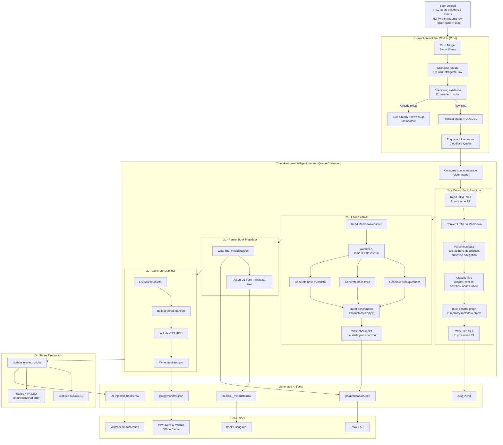
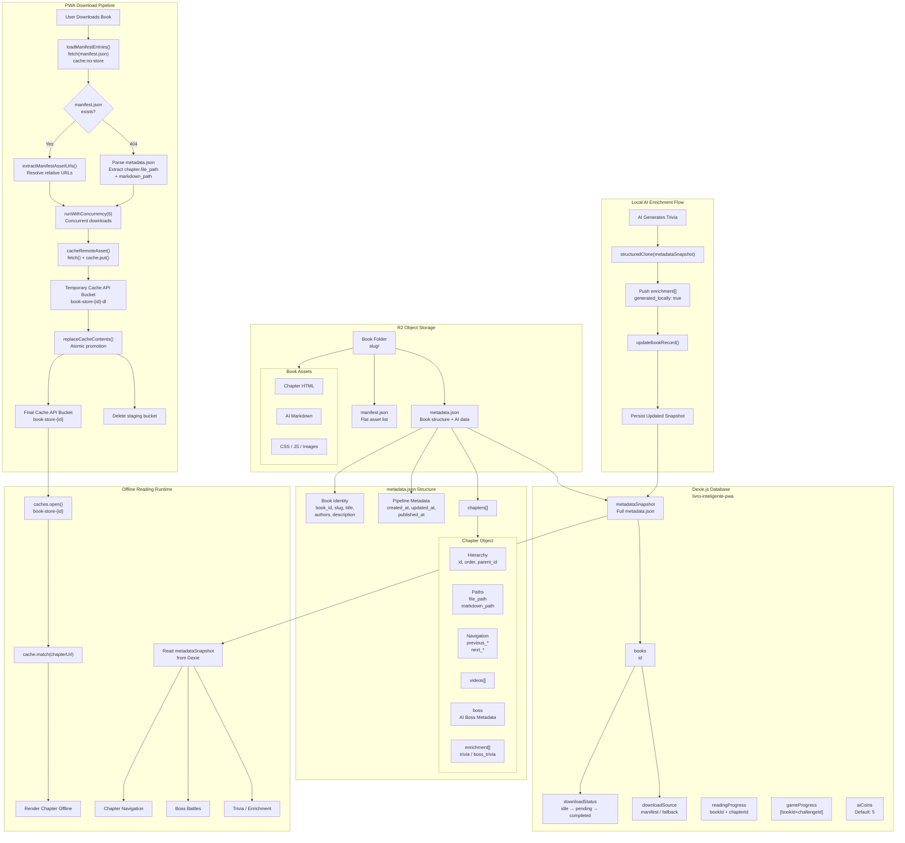

# Pipeline de ingestão

# Estratégia de geração de dia zero, geração sob demanda e estruturação do runtime

# Segurança

O sistema deixa de lado algumas características estruturais de segurança em prol de facilidade de apresentação e de foco, cruzando tempo com complexidade, em entregar um livro que encanta. Existem dois pontos críticos de segurança que são conhecidos e que DEVEM ser atacados numa V2:
- É necessário criar uma estrutura de login e acesso dos usuários. Isso pode ser feito com uma modelagem dos dados de usuário / leitor somado à um fluxo de autenticação e autorização com JWT. Também é preciso proteger as rotas da API com acesso.
- É necessário bloquear o acesso público da máquina R2, e encapsular o livro em rotas protegidas. Para acesso à um livro, podemos utilizar a geração de links assinados, por exemplo. Porém, a estrutura de leitura e armazenamento pode não ficar mais tão trivial, e pode precisar de um retrabalho no PWA e no formato de acesso aos arquivos como um todo. Por conta dessa complexidade, preferi evitar trabalhar nisso agora, mas para uma próxima versão se faz extremamente necessário. 

# Trade-offs

Foram tomadas as seguintes decisões globais:
- Foco em subir toda a estrutura no Cloudflare. O principal trade-off aqui é para o fluxo de ingestão, que poderia ter sido rodado local, por exemplo. Mas eu decidi usar e complexar um pouco o fluxo também para aprender alguns itens de infraestrutura da cloudflare que ainda não tinha tido oportunidade de estudar. Porém, o fluxo ficou funcional e generalista. Para uma V2, usaria apenas o fluxo de Workflows diretamente disparado pelo watcher, ao invés de um CRON + Queue. 
- Foco na interatividade / encantamento do livro e no respeito ao requisito de funcionamento offline no day zero, focando menos em exibir conhecimento técnico e mais em entregar uma visão mista de alinhamento com a estratégia e decisões técnicas guiadas pelo prazo curto e apertado. É necessário em uma V2 priorizar a proteção dos arquivos do Livro e a estrutura de usuário para progeter com login o acesso mas também sincronizar o status em múltiplos dispositivos;
- Simplicidade estrutural da representação e interface de consumo dos livros;
- Visão de futuro para o pipeline de ingestão e para o consumo do que foi gerado no PWA, com foco na possibilidade continua de adição de novas maneiras de enriquecimento (métodos de enriquecimento no fluxo `make-book-intelligent`) mas também na flexibilidade de consumo desses enriquecimentos (criação de widgets flutuantes);
- Evitar otimização prematura em prol de ter um resultado mais rico no processo de enriquecimento do livro, o que implica em um custo de IA que pode ser otimizado no futuro; 
- Solução aberta, focada na faclididade de explorar e testar, com o conhecimento dos trade offs de funcionalidades e segurança;